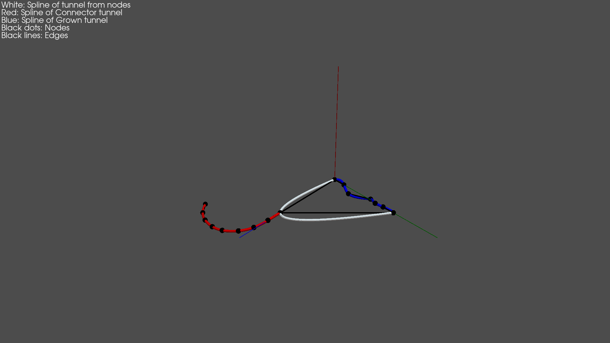
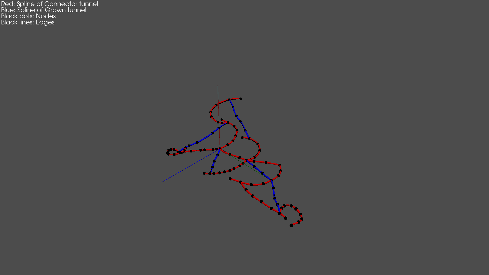
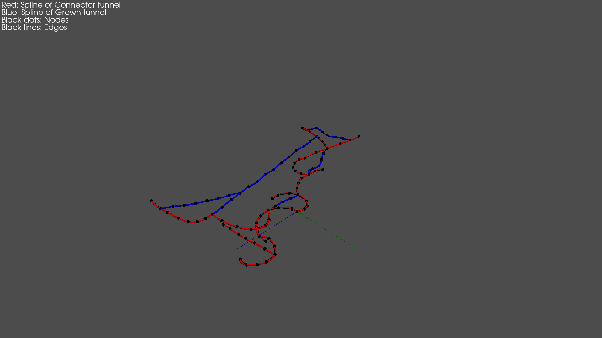

# Procedural Environments for Underground Robotics

## Overview

This repo contains a Python package designed to generate underground tunnel networks in a procedural way, with the purpose of robotics testing.

## Instalation

After cloning the repository, move to it and run:

```bash
pip3 install -r requirements.txt
pip3 install -e .
```

## Examples

In the folder ```scripts``` there are some executable python files, each showcasing a part of the library.

### snippet_1.py

This file showcases the different ways of creating ```Tunnel``` instances. There are three:

1. From Nodes: The user specifies the position of the nodes manually.
2. Connector tunnel: The user specifies an initial and final node and a tunnel is generated between them.
3. Grown Tunnel: The user speciefies an initial node and direction, and a tunnel is generated from it.



### snippet_2.py

This file shows how to use the tunnel creation functionalities inside the TunnelNetwork class.

1. ```TunnelNetwork.add_random_grown_tunnel()```: This function automates the selection of the initial node, initial direction and the checking process.
2. ```TunnelNetwork.add_random_connector()```: This function automates the seleciton of the initial and final nodes, as well as the checks of the final tunnel.

If you need to create complex and random environments, these functions are the easiest ones to use. The following images are some of the resulting tunnel networks generated with the script.



